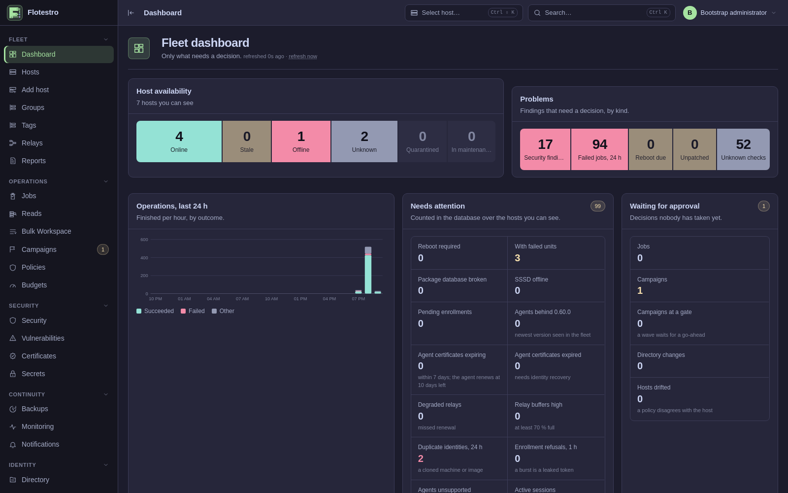
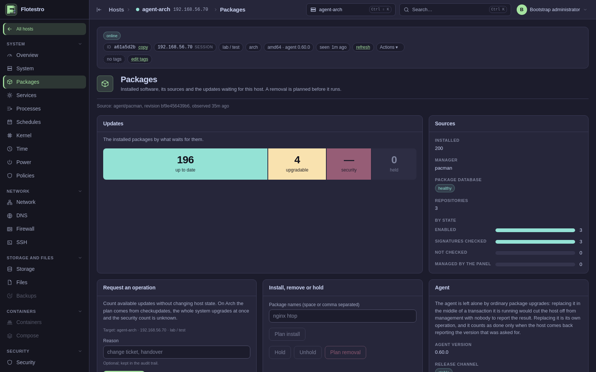
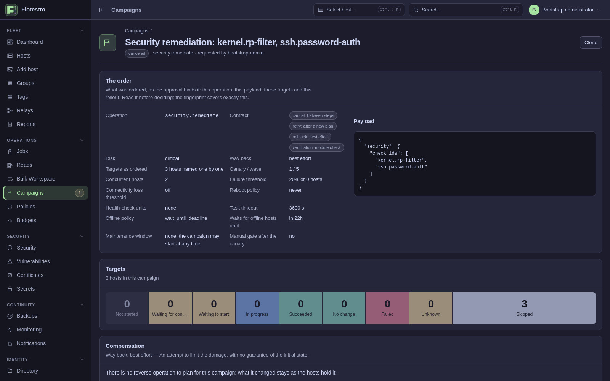
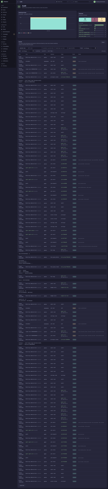

<div align="center">


**Run your Linux fleet from one panel.**

Debian · Ubuntu · Fedora · RHEL · Arch — packages, services, files, firewall,
storage, containers, certificates and monitoring, on every host, from one place.

[Documentation](https://ultherego.github.io/Flotestro/docs/) ·
[Install](#install) ·
[Screenshots](#screenshots)

</div>

---

## Why you would want it

**One panel instead of five tools.** Inventory, packages, services, files,
network, firewall, storage, containers, accounts, certificates, backups,
monitoring, alerting, CVEs and compliance — the same fleet, the same
permissions, the same audit trail.

**No shell on your servers.** There is no "run this command" action. Every
change is a typed operation with its own permission and risk level, so a
mistake is refused instead of executed.

**See the plan before it happens.** The host works out what would change, you
read it, you approve it — and the host applies it only if what it found still
matches what you approved.

**Nothing pretends to be fine.** A fact the agent could not read is shown as
unknown, never as zero. A host that cannot answer is a host that cannot answer.

**No monitoring stack to run.** Agents sample their own host, the panel keeps
the samples, evaluates the rules and sends the alerts. No Prometheus, no Loki,
no Alertmanager.

**Proof, not logs.** Every order, approval and result is an event in a
hash-chained trail that `flotestro-auditverify` checks offline, without the
database.

## Install

**The panel**, with a database of its own:

```bash
curl -fsSLO https://raw.githubusercontent.com/ultherego/Flotestro/main/docker/compose.yaml
docker compose --profile quickstart up -d
docker compose cp control-plane:/var/lib/flotestro/bootstrap-token .
```

Open <http://localhost:8080>, sign in with the token, and add your first host.
Every setting has a working default; to serve hosts on other machines, put your
own address in `.env` — [`env.example`](docker/env.example) lists all of them
and names the three that matter.

**A host:**

```bash
curl -fsS https://ultherego.github.io/Flotestro/packages/flotestro-repo.asc | sudo tee /etc/apt/keyrings/flotestro.asc >/dev/null
echo 'deb [signed-by=/etc/apt/keyrings/flotestro.asc] https://ultherego.github.io/Flotestro/packages/deb stable main' | sudo tee /etc/apt/sources.list.d/flotestro.list >/dev/null
sudo apt update && sudo apt install flotestro-agent
```

`dnf` and `pacman` are in the [documentation](https://ultherego.github.io/Flotestro/docs/installation.html).
The panel writes the enrollment command for each host under **Add host**, and
[`ansible`](ansible) does the same for a hundred hosts at once.

Everything else — an external database, a relay for a remote site, an
air-gapped installation, backups, upgrades — is in the
[documentation](https://ultherego.github.io/Flotestro/docs/).

## Screenshots

<table>
  <tr>
    <td width="50%"></td>
    <td width="50%"></td>
  </tr>
  <tr>
    <td>What needs a decision, and the fleet at a glance.</td>
    <td>A host's packages: the plan, its digest, and what may be asked for.</td>
  </tr>
  <tr>
    <td width="50%"></td>
    <td width="50%"></td>
  </tr>
  <tr>
    <td>A campaign across the fleet: canary, waves, gates and thresholds.</td>
    <td>The audit trail: the actor, the request and the authentication behind it.</td>
  </tr>
</table>

<a href="https://ultherego.github.io/Flotestro/docs/">The rest of the panel, in the documentation →</a>

## Built from

Go for the control plane, the agent, the root helper and the relay; React and
TypeScript for the panel; PostgreSQL for everything it remembers. The agent and
its helper are native packages, not containers, because a host agent has to see
the real `/proc`, the real disks and the real systemd.

Images are published to
[GHCR](https://github.com/ultherego/Flotestro/pkgs/container/flotestro-control-plane)
and packages to the signed
[apt, dnf and pacman repository](https://ultherego.github.io/Flotestro/packages/),
each with a build attestation that says which run produced it.

Building it, the conventions the code holds to and what CI checks are in
[CONTRIBUTING.md](CONTRIBUTING.md). What changed between releases is in
[CHANGELOG.md](CHANGELOG.md).

## Reporting a vulnerability

One installation holds the fleet's certificate authority, its secret store and
a root helper on every managed host. Please read [SECURITY.md](SECURITY.md)
before opening anything in public.

## Licence

[Apache License 2.0](LICENSE). Copyright 2026 Ulther Ego.
