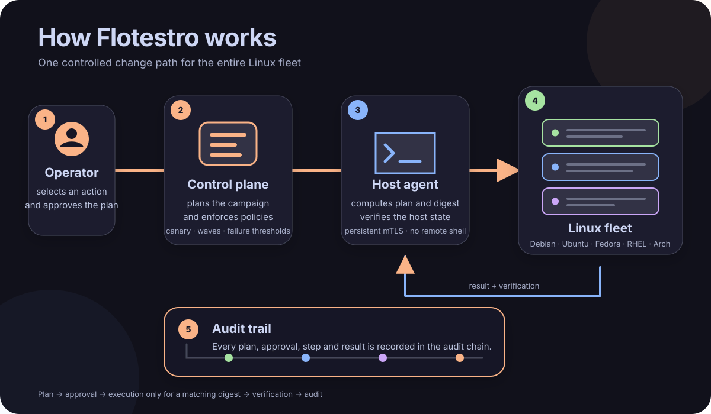

<div align="center">


</div>

<p align="center">
  Fleet management for Linux servers.<br>
  One panel that plans, approves, carries and records changes across Debian, Ubuntu, Fedora, RHEL and Arch hosts.
</p>

<p align="center">
  <a href="#why-flotestro">Why</a> ·
  <a href="#features">Features</a> ·
  <a href="#screenshots">Screenshots</a> ·
  <a href="#how-a-change-happens">How it works</a> ·
  <a href="#architecture">Architecture</a> ·
  <a href="#quick-start">Quick start</a> ·
  <a href="#building">Building</a>
</p>

## Why Flotestro

- **Typed operations only.** Every action is a versioned contract with its own permission, risk level, lock class and campaign mode. There is no "run a command" type; the panel never runs a shell on a host.
- **Plans approved by digest.** The host computes the plan, an approver reads it, and the host applies it only if the content still matches the approved digest.
- **Unknown is shown as unknown.** A fact the agent could not determine is empty, not zero; a missing declaration means a refusal, not consent.
- **Evidence, not logs.** Every order, approval and result is an event in a hash-chained audit trail that `auditverify` checks offline, without the database.
- **No external monitoring stack.** Agents sample their host, the panel keeps the samples and rollups, evaluates rules, and holds alerts and silences.

## Features

| Area | Operations |
|---|---|
| Packages | plan, upgrade, install, remove, hold, repair; per-host plans approved by digest; agent upgrades |
| Services and processes | start, stop, restart, reload, enable, mask, reset-failed; unit detail; process tree; signals |
| Files and schedules | managed files with versions and rollback; cron entries and systemd timers |
| Network and firewall | NetworkManager, nmstate, netplan with a connectivity watchdog; firewalld, nftables, UFW; resolver |
| Storage | mounts, filesystem check and resize, LVM, SMART, device wipe |
| Containers | Docker containers, images, prune, events, logs; Compose projects deployed against a plan |
| Kernel and security | sysctl, modules, SELinux mode, audit rules; security checks with fleet-wide remediation |
| Time | chrony and timesyncd, time zone, source test before a source is replaced |
| Identity | FreeIPA users, groups, HBAC and sudo rules, access simulation, domain joins; local accounts and keys |
| Certificates and backups | scanning, trust-anchor rotation, certmonger renewal; restic and borg runs, verification, restore |
| Monitoring | CPU, memory, swap, filesystems, inodes, uptime sampled by the agent; alert rules and silences in the panel |
| Vulnerabilities | package lists correlated against Debian, Ubuntu, Red Hat and NVD feeds; the panel reads the feeds, never the hosts |
| Campaigns | canary, waves, manual or automatic gates, failure thresholds, maintenance windows, per-site budgets, offline policy per host |
| Notifications | durable trail posted to a webhook in batches, signed with HMAC-SHA256, delivered at least once and in order |

## Screenshots

<p align="center"></p>

<table>
  <tr>
    <td></td>
    <td></td>
  </tr>
  <tr>
    <td>Hosts with state, site, environment and what needs attention.</td>
    <td>One page per module with the facts as the agent reported them.</td>
  </tr>
  <tr>
    <td></td>
    <td></td>
  </tr>
  <tr>
    <td>Packages of a host: the plan, its digest and the actions the operator may take.</td>
    <td>A campaign across the fleet: canary, waves, gates and thresholds.</td>
  </tr>
  <tr>
    <td></td>
    <td></td>
  </tr>
  <tr>
    <td>Versioned security checks judged in the panel; a fix for many hosts is one campaign with one approval.</td>
    <td>Built-in monitoring: raw samples, rollups, rules, alerts and silences.</td>
  </tr>
  <tr>
    <td></td>
    <td></td>
  </tr>
  <tr>
    <td>Audit trail: the actor, the request and the authentication it rested on.</td>
    <td></td>
  </tr>
</table>

## How a change happens

<div align="center">



</div>

1. The host computes a plan of the change and reports its digest.
2. An approver reads the plan; in production a second person approves.
3. The host applies the change only if its content still matches the approved digest.
4. The result, the verification and every step are written to a hash-chained audit trail.

Across a fleet the same change runs as a campaign: canary, waves, manual or automatic
gates, failure thresholds, maintenance windows, per-site budgets, offline policy per host.

## Architecture

| Component | Runs as | Role |
|---|---|---|
| `flotestro-control-plane` | service on the panel server | API, web panel, agent gateway, enrollment, scheduler, campaign engine, PKI, PostgreSQL |
| `flotestro-agent` | unprivileged user on every host | one mTLS session to the gateway; inventory, metrics, plans; hands privileged steps to the helper |
| `flotestro-agent-helper` | root, socket-activated | executes the fixed set of privileged operations over a local socket; no network |
| `flotestro-relay` | unprivileged, one per isolated site | terminates agent sessions of a site and forwards them; buffers results during an outage |

Hosts hold a certificate from the fleet CA, issued at enrollment from a key that never
leaves the host, renewed by the agent itself, revoked when superseded. Enrollment tokens
are one-time and stored as digests. Users sign in through OpenID Connect; roles come from
group mappings scoped by site and environment; sensitive actions need step-up
authentication. Secrets are fetched by the host under a short lease and never travel in a
task. PostgreSQL is the only source of truth; the panel keeps the fleet state nowhere else.

## Quick start

Control plane (PostgreSQL required; the schema is migrated at start):

```
apt install flotestro-control-plane          # or dnf
vi /etc/flotestro/control-plane.env          # FLOTESTRO_DATABASE_URL, FLOTESTRO_PUBLIC_URL, FLOTESTRO_OIDC_*, FLOTESTRO_IPA_*
systemctl enable --now flotestro-control-plane
cat /var/lib/flotestro/bootstrap-token       # written at first start; maps identity-provider groups to roles
```

Host:

```
apt install flotestro-agent                  # or dnf, pacman
vi /etc/flotestro/agent.yaml                 # enrollment_url, gateway_urls
sudo -u flotestro-agent flotestro-agentctl enroll --token-file /run/token   # token from an enrollment request in the panel
systemctl enable --now flotestro-agent
flotestro-agentctl diagnose                  # explains a host that does not show up
```

Runbooks for CA rotation, database restore, queue backlog, a full relay buffer and quarantine are in [docs/runbooks](docs/runbooks/index.md); every environment variable of every binary is in [docs/configuration.md](docs/configuration.md).

A whole inventory with Ansible:

```
ansible-playbook -i inventory.ini site.yml -e flotestro_automation_api_token="$TOKEN"   # deploy/ansible; one-time token ordered per host
```

| Port | Service |
|---|---|
| 8080 | panel and API; loopback by default, put behind a TLS proxy |
| 8443 | agent gateway (mTLS) |
| 8444 | enrollment (TLS) |
| 8453 | relay |

## Building

Go 1.25 for the services, Node.js for the panel.

```
make build                                   # control plane, agent, auditverify
make generate                                # code from api/proto
make test                                    # unit tests
make lint                                    # gofmt and go vet
(cd web && npm ci && npm run build)          # the panel
packaging/build-release.sh all 1.0.0 dist    # packages for amd64 and arm64 with a CycloneDX SBOM
packaging/sign-repo.sh dist <gpg-key> repo   # signed apt, dnf and pacman repositories
```

GitHub Actions in `.github/workflows` run the same checks, the vulnerability scan and the fuzz targets on every push, and build the packages of a `v*` tag.

## Repository layout

```
api/proto/    protobuf contracts       internal/     the product      web/        the panel
cmd/          entry points             db/           migrations       packaging/  units, templates, package builds
deploy/       Ansible role             tests/        integration tests against a live fleet
```
