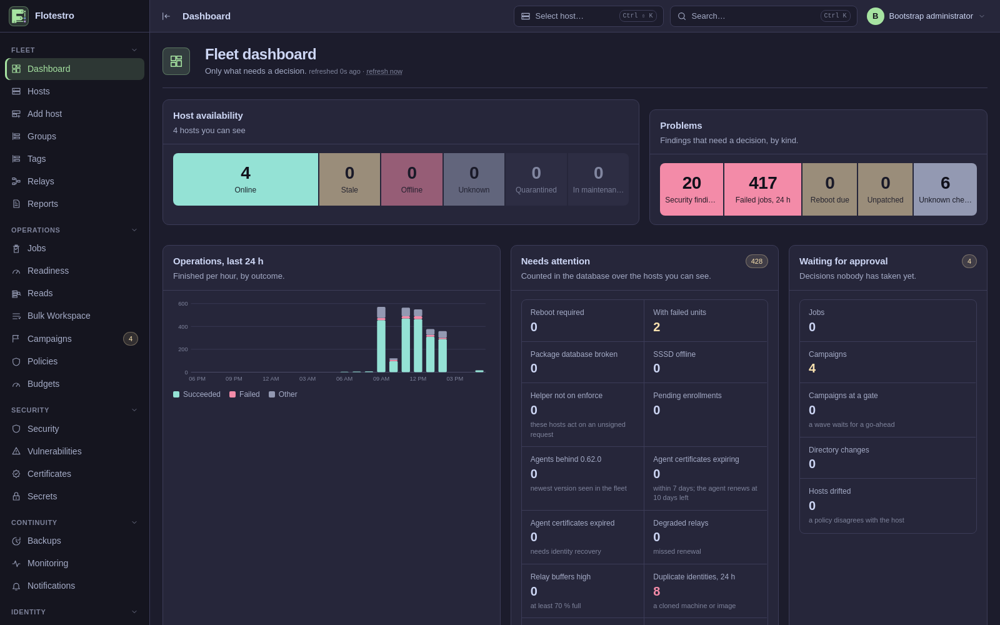
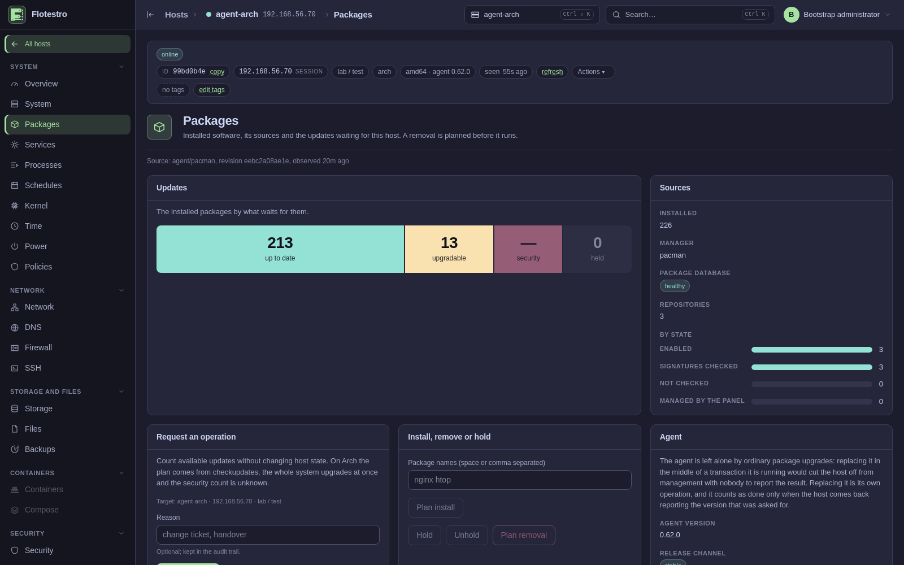
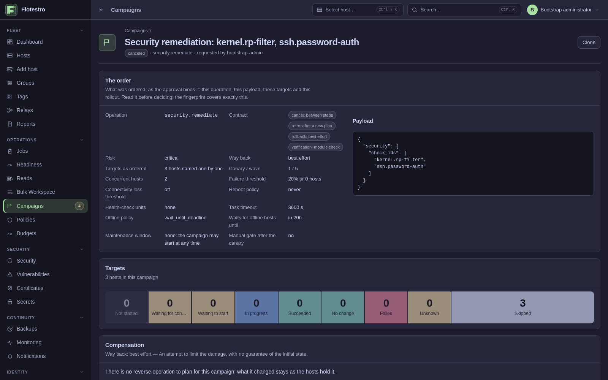
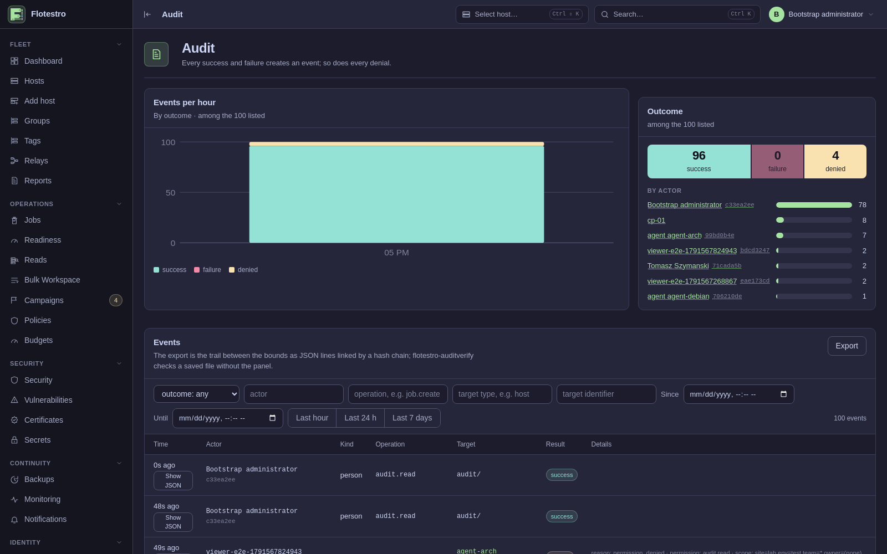

<div align="center">


**Run your Linux fleet from one panel.**

Debian · Ubuntu · Fedora · RHEL · Arch — packages, services, files, firewall,
storage, containers, certificates and monitoring, on every host, from one place.

[Documentation](https://ultherego.github.io/Flotestro/docs/) ·
[Install](#install) ·
[Screenshots](#screenshots)

</div>

---

## Why you would want it

**One panel instead of five tools.** Inventory, packages, services, files,
network, firewall, storage, containers, accounts, certificates, backups,
monitoring, alerting, CVEs and compliance — the same fleet, the same
permissions, the same audit trail.

**No shell on your servers.** There is no "run this command" action. Every
change is a typed operation with its own permission and risk level, so a
mistake is refused instead of executed.

**See the plan before it happens.** The host works out what would change, you
read it, you approve it — and the host applies it only if what it found still
matches what you approved.

**Nothing pretends to be fine.** A fact the agent could not read is shown as
unknown, never as zero. A host that cannot answer is a host that cannot answer.

**No monitoring stack to run.** Agents sample their own host, the panel keeps
the samples, evaluates the rules and sends the alerts. No Prometheus, no Loki,
no Alertmanager.

**Proof, not logs.** Every order, approval and result is an event in a
hash-chained trail that `flotestro-auditverify` checks offline, without the
database.

## Install

**The panel** is a container image and is deployed no other way. With a database
of its own:

```bash
curl -fsSLO https://raw.githubusercontent.com/ultherego/Flotestro/main/docker/compose.yaml
docker compose up -d
docker compose cp control-plane:/var/lib/flotestro/bootstrap-token .
```

Open <http://localhost:8080>, sign in with the token, and add your first host.
Every setting has a working default; to serve hosts on other machines, put your
own address in `.env` — [`env.example`](docker/env.example) carries the three
that matter for a first installation and the ones most deployments touch after
it. The whole list is in
[5. Configuration](https://ultherego.github.io/Flotestro/docs/configuration.html).

**A host:**

```bash
curl -fsS https://ultherego.github.io/Flotestro/packages/flotestro-repo.asc | sudo tee /etc/apt/keyrings/flotestro.asc >/dev/null
echo 'deb [signed-by=/etc/apt/keyrings/flotestro.asc] https://ultherego.github.io/Flotestro/packages/deb stable main' | sudo tee /etc/apt/sources.list.d/flotestro.list >/dev/null
sudo apt update && sudo apt install flotestro-agent
```

For `dnf`, the same key and one file under `/etc/yum.repos.d`:

```bash
sudo rpm --import https://ultherego.github.io/Flotestro/packages/flotestro-repo.asc
printf '%s\n' '[flotestro]' 'name=Flotestro' \
    'baseurl=https://ultherego.github.io/Flotestro/packages/rpm/stable' \
    'enabled=1' 'gpgcheck=1' 'repo_gpgcheck=1' \
    'gpgkey=https://ultherego.github.io/Flotestro/packages/flotestro-repo.asc' |
    sudo tee /etc/yum.repos.d/flotestro.repo >/dev/null
sudo dnf install flotestro-agent
```

For `pacman`, the key has to be imported and locally signed before the server
line, or the database is refused as untrusted:

```bash
curl -fsS https://ultherego.github.io/Flotestro/packages/flotestro-repo.asc | sudo pacman-key --add -
sudo pacman-key --lsign-key "$(curl -fsS https://ultherego.github.io/Flotestro/packages/flotestro-repo.asc \
    | gpg --show-keys --with-colons | awk -F: '/^fpr:/ {print $10; exit}')"
printf '%s\n' '[flotestro]' 'SigLevel = Required DatabaseRequired' \
    'Server = https://ultherego.github.io/Flotestro/packages/arch/stable' |
    sudo tee -a /etc/pacman.conf >/dev/null
sudo pacman -Sy && sudo pacman -S --noconfirm flotestro-agent
```

What the repository carries is on [its own pages](https://ultherego.github.io/Flotestro/packages/),
and the rest is in the
[documentation](https://ultherego.github.io/Flotestro/docs/installation.html).
The panel writes the enrollment command for each host under **Add host**, and
[`ansible`](ansible) does the same for a hundred hosts at once.

Everything else — an external database, a relay for a remote site, an
air-gapped installation, backups, upgrades — is in the
[documentation](https://ultherego.github.io/Flotestro/docs/).

## Screenshots

<table>
  <tr>
    <td width="50%"></td>
    <td width="50%"></td>
  </tr>
  <tr>
    <td>What needs a decision, and the fleet at a glance.</td>
    <td>A host's packages: the plan, its digest, and what may be asked for.</td>
  </tr>
  <tr>
    <td width="50%"></td>
    <td width="50%"></td>
  </tr>
  <tr>
    <td>A campaign across the fleet: canary, waves, gates and thresholds.</td>
    <td>The audit trail: the actor, the request and the authentication behind it.</td>
  </tr>
</table>

<a href="https://ultherego.github.io/Flotestro/docs/">The rest of the panel, in the documentation →</a>

## Built from

Go for the control plane, the agent, the root helper, `agentctl` and the relay;
React and TypeScript for the panel; PostgreSQL for everything it remembers.

The split is deliberate and each half has one form. The panel, the relay, the
administration tools and the migrator are OCI images, deployed with the Compose
files in [`docker/`](docker); there is no package of any of them. The agent, its
root helper and `flotestro-agentctl` are one native package per family, because
they manage the host itself — its PID 1, its devices, its package database — and
a container that could do that would be a `--privileged` container with nothing
isolated about it.

Images are published to
[GHCR](https://github.com/ultherego/Flotestro/pkgs/container/flotestro-control-plane)
and the package to the signed
[apt, dnf and pacman repository](https://ultherego.github.io/Flotestro/packages/),
each with a build attestation that says which run produced it.

Building it, the conventions the code holds to and what CI checks are in
[CONTRIBUTING.md](CONTRIBUTING.md). What changed between releases is in
[CHANGELOG.md](CHANGELOG.md).

## Reporting a vulnerability

One installation holds the fleet's certificate authority, its secret store and
a root helper on every managed host. Please read [SECURITY.md](SECURITY.md)
before opening anything in public.

## Licence

[Apache License 2.0](LICENSE). Copyright 2026 Ulther Ego.
